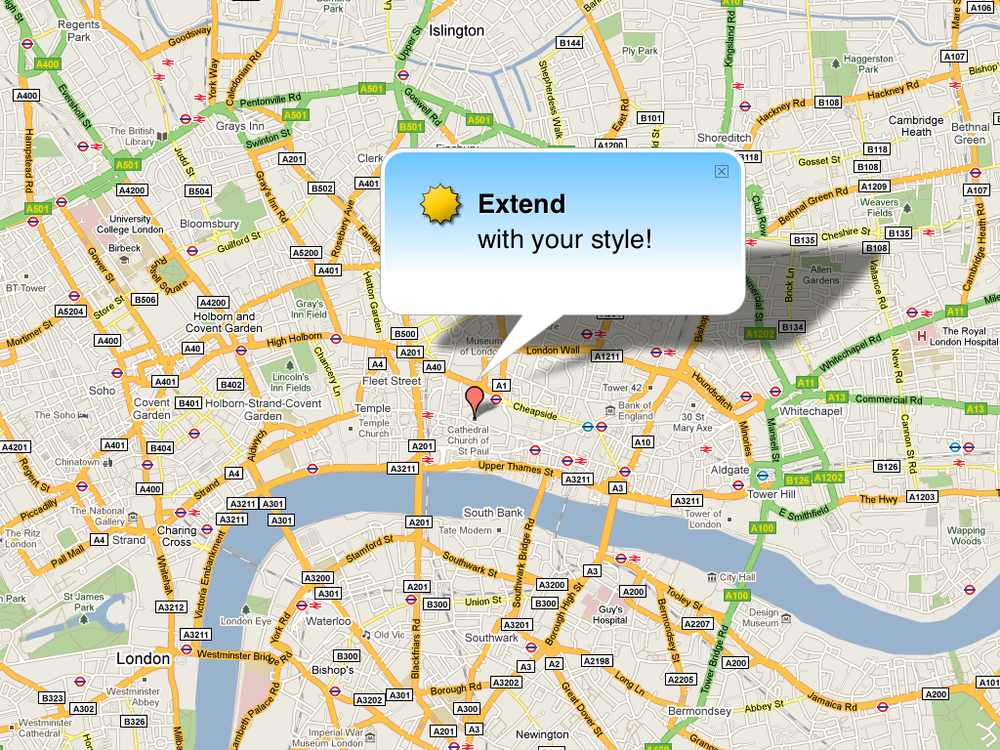

!SLIDE bullets incremental

# Design #

* Keep Defaults
* Shapes on the Map
* Color Palette

!SLIDE 
# Marker #

!SLIDE center 

!SLIDE center 

!SLIDE center 

!SLIDE
## Marker = Pointer ##

!SLIDE center

!SLIDE center

!SLIDE 
# Infowindow #

!SLIDE center

!SLIDE center

!SLIDE center

!SLIDE center

!SLIDE center

!SLIDE center
# Color #

!SLIDE bullets

* How many markers
* do you see on the 
* following slide?

!SLIDE center

!SLIDE bullets
# GAME OVER #

* Time is up!

!SLIDE bullets incremental

* None ?
* One ?
* Two ?
* Three ?
* Four ?
* Five ?
* Six or more ?

!SLIDE center

!SLIDE center
## Reserved Colors ##

