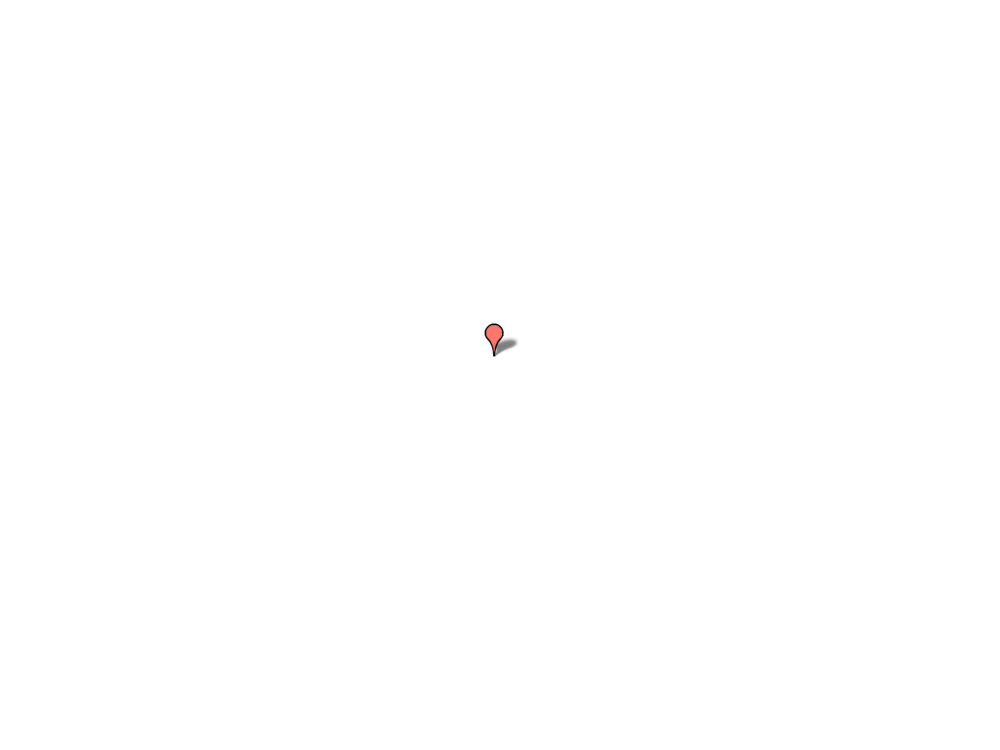
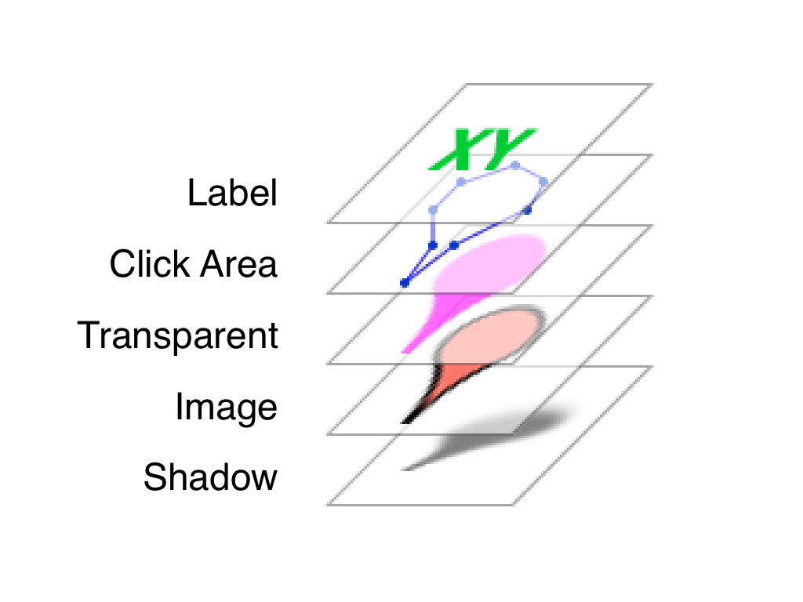
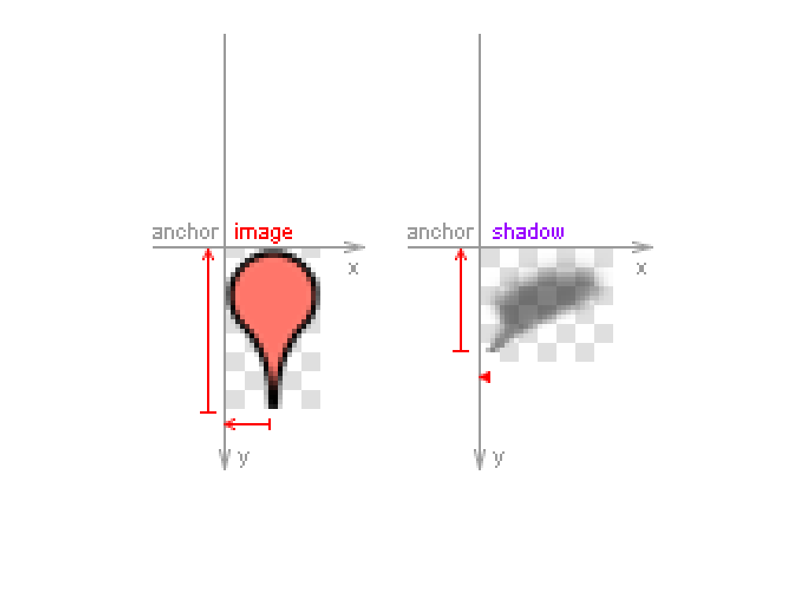
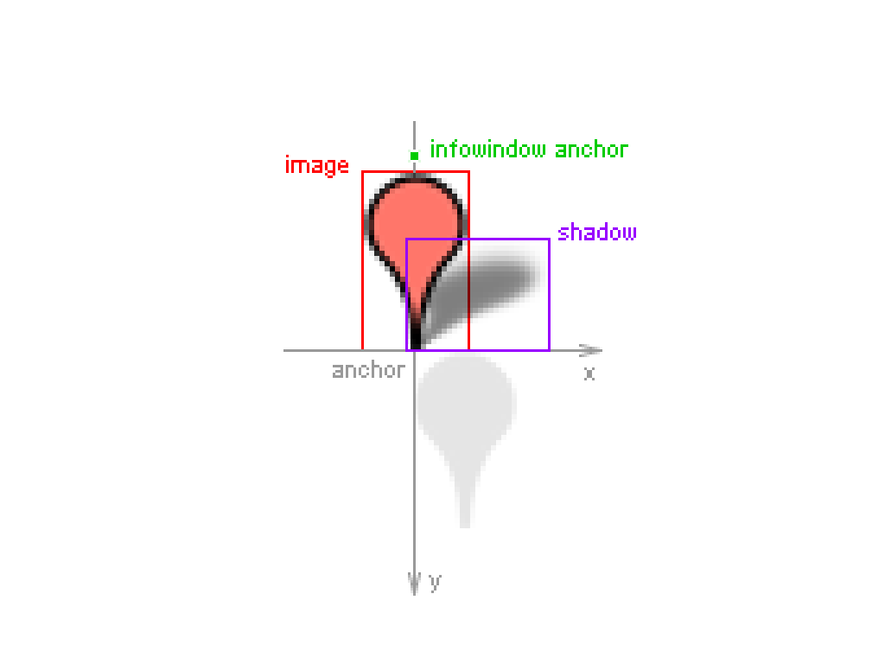
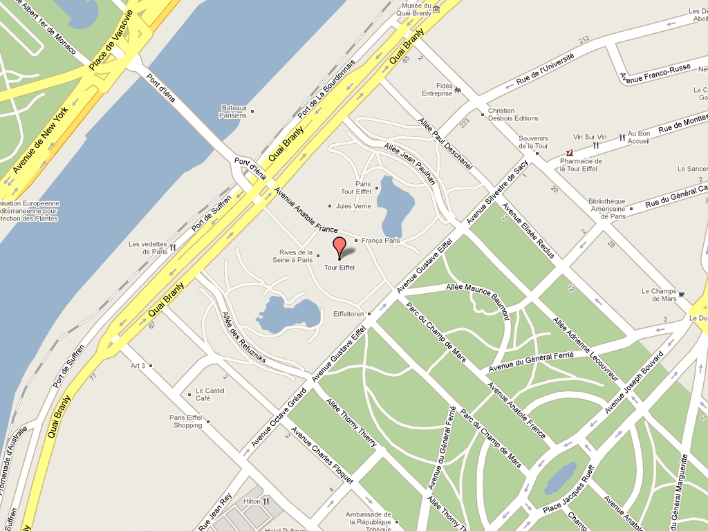
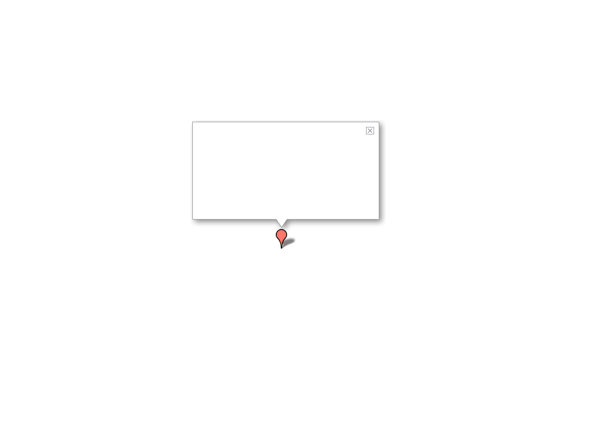
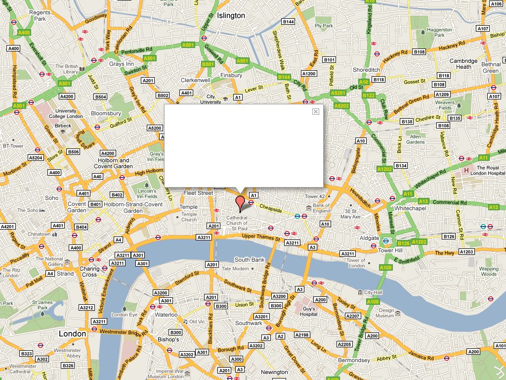
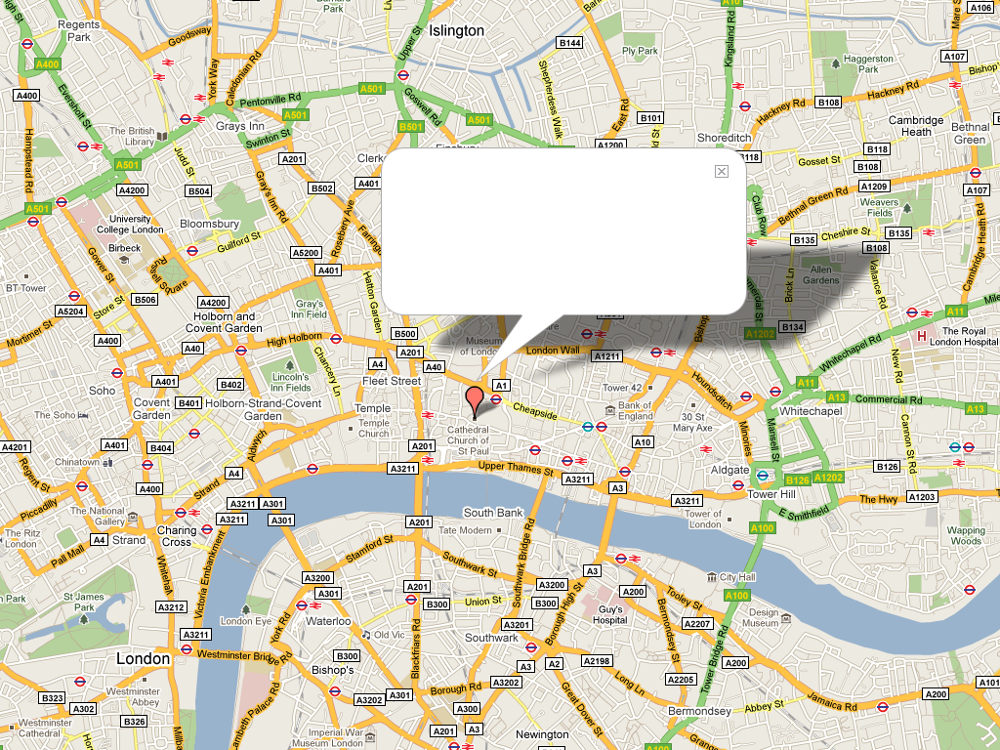
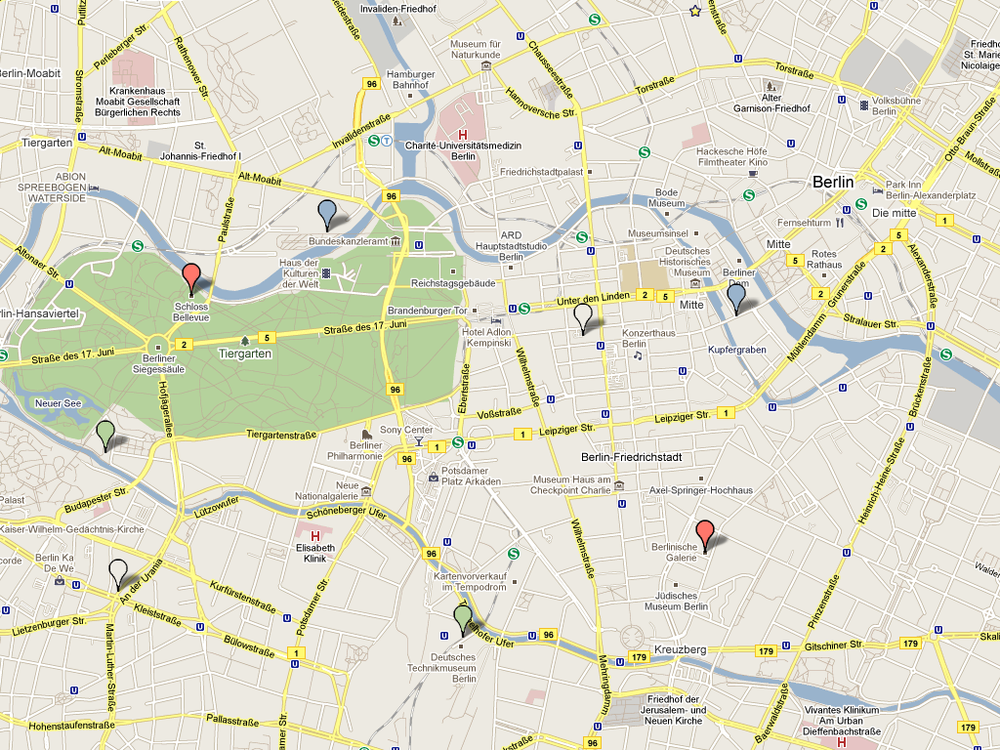

!SLIDE bullets

# Design #

* Keep defaults
* Use the right shapes
* Test colors

!SLIDE bullets 
# Marker #

!SLIDE center 

!SLIDE center 

!SLIDE center 

!SLIDE center

!SLIDE center

!SLIDE
## Do not cover ##

!SLIDE center

!SLIDE center

!SLIDE center

!SLIDE center

!SLIDE center

!SLIDE center

!SLIDE center
# Colors #

!SLIDE bullets

## How many markers ##

* do you see   
* on the following map?

!SLIDE center

!SLIDE
# GAME OVER! #

!SLIDE bullets
* None ?
* One ?
* Two ?
* Three ?
* Four ?
* Five ?
* Six or more ?

!SLIDE center

!SLIDE center
# Colors #

!SLIDE bullets
# Test Map Types #

!SLIDE center
# Infowindow #

