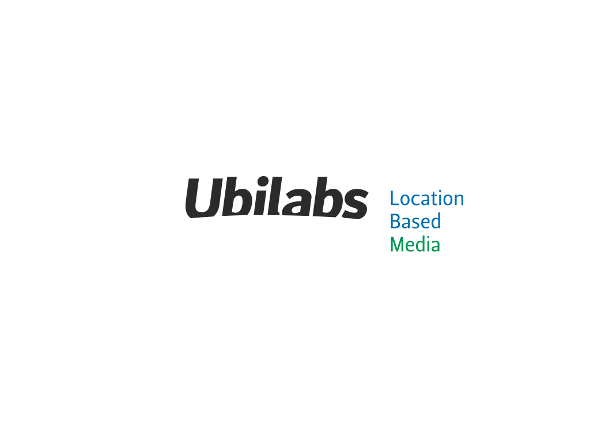
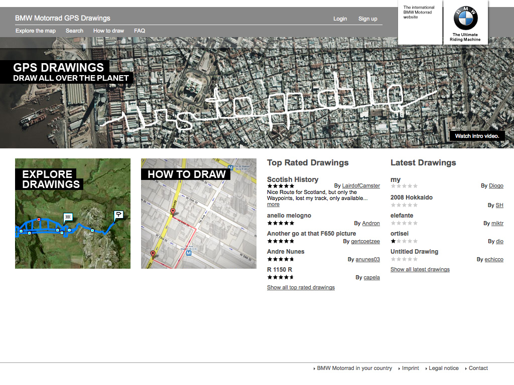
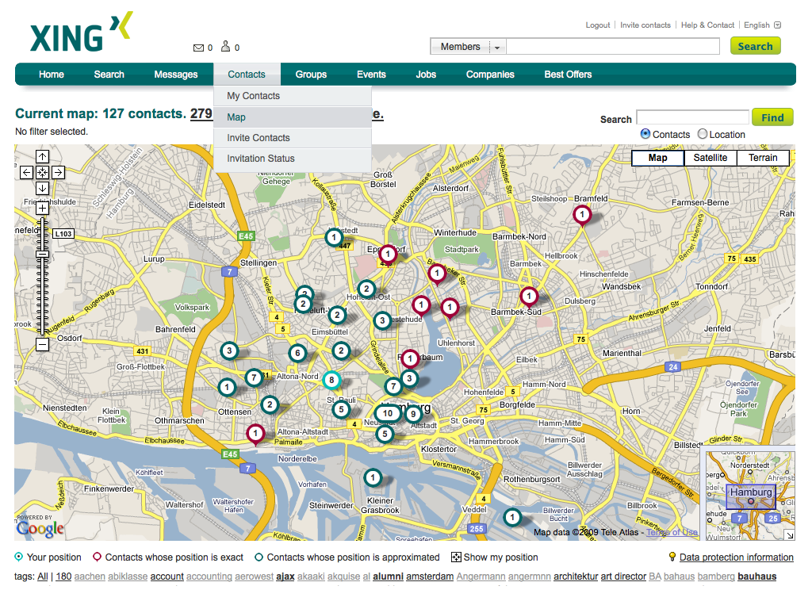
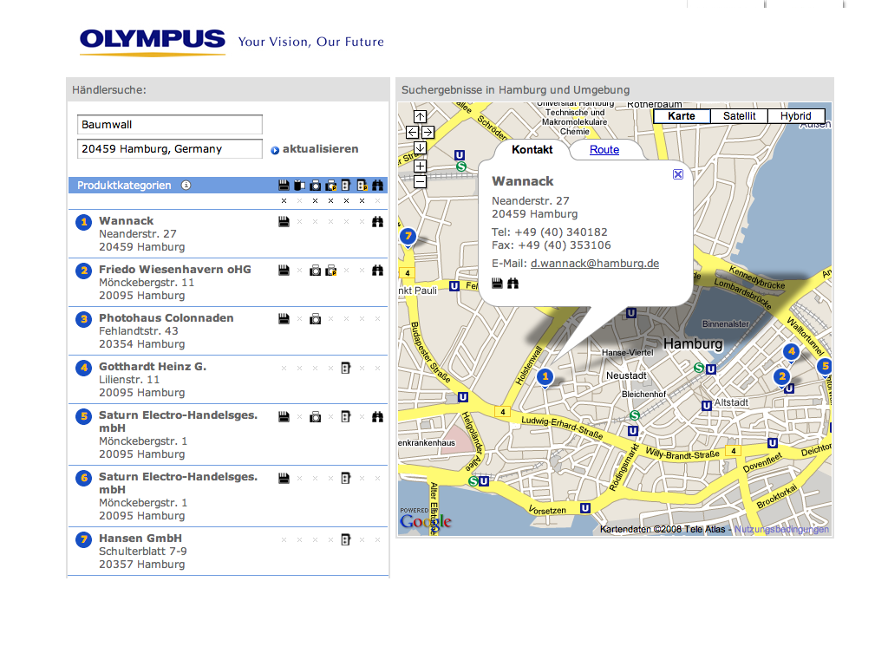
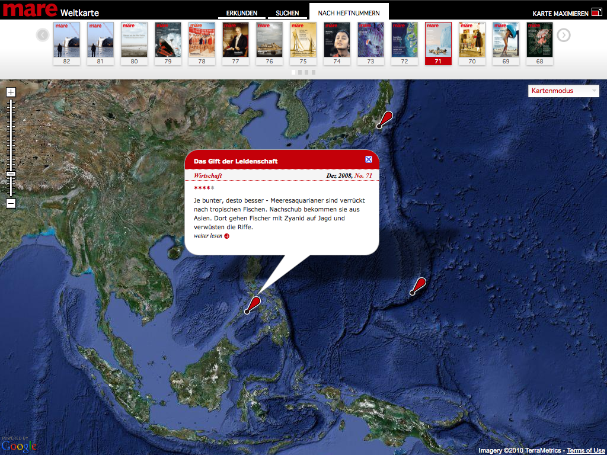
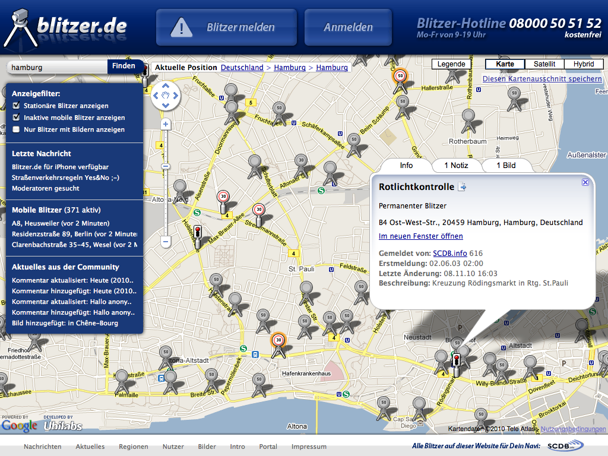
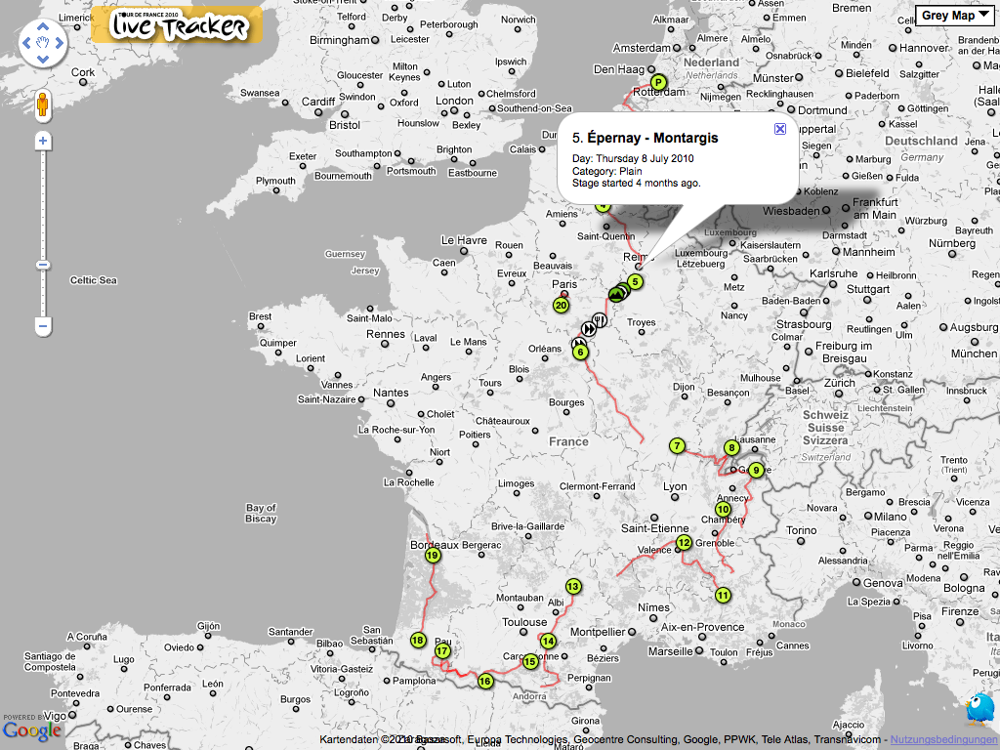
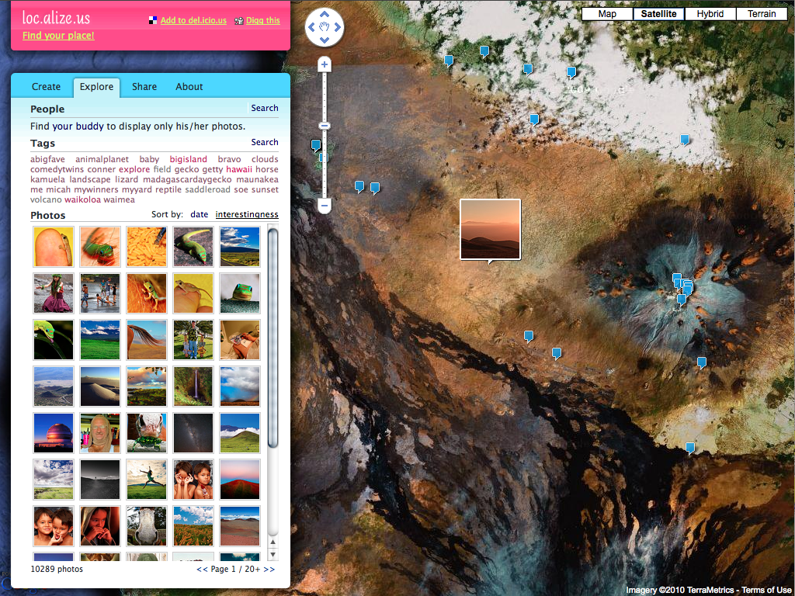
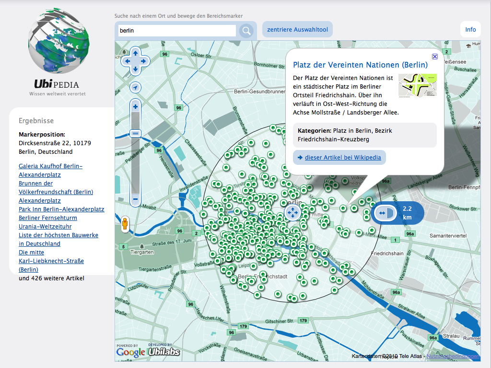
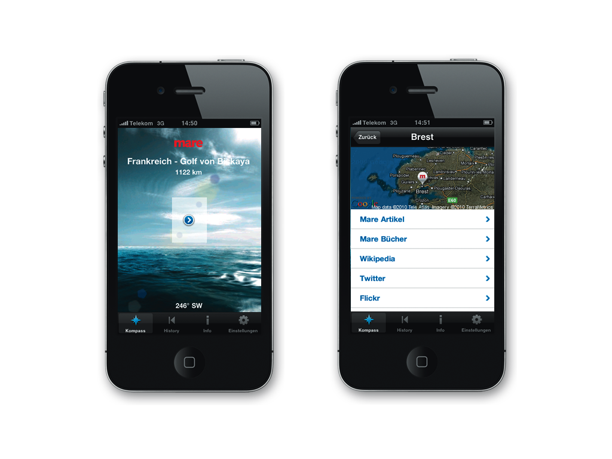

!SLIDE bullets title-slide 

* 

# Google Maps API #

* 

## Best Practices ##

* Martin Kleppe (@aemkei)

!SLIDE bullets incremental

## About Me ##

* Google Qualified Developer
* Proctor JS Maps API
* Ubilabs - Location based Media
* Head of Development

!SLIDE center

!SLIDE center

!SLIDE center

!SLIDE center

!SLIDE center

!SLIDE center

!SLIDE center

!SLIDE center

!SLIDE center

!SLIDE center

!SLIDE center

!SLIDE bullets incremental

## Today's Topics ##

* Design
* Performance
* Data
* Tools

!SLIDE 

## Let's talk about … ##

