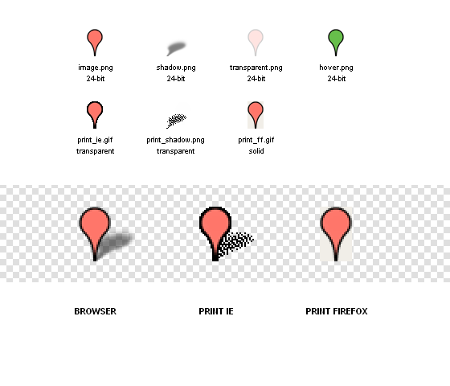
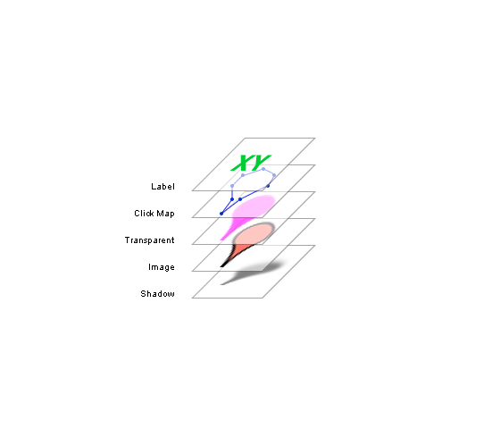
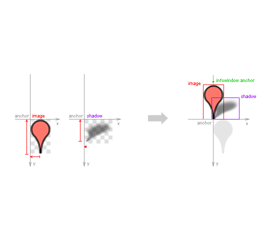
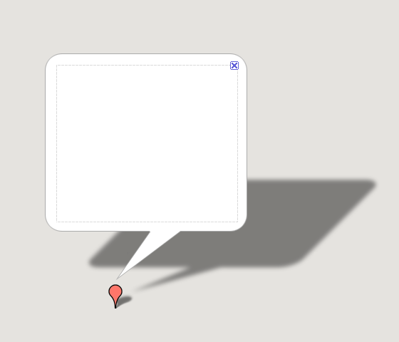
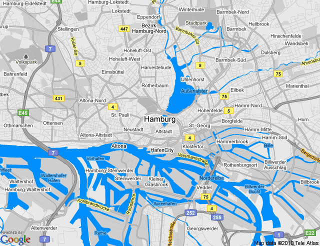
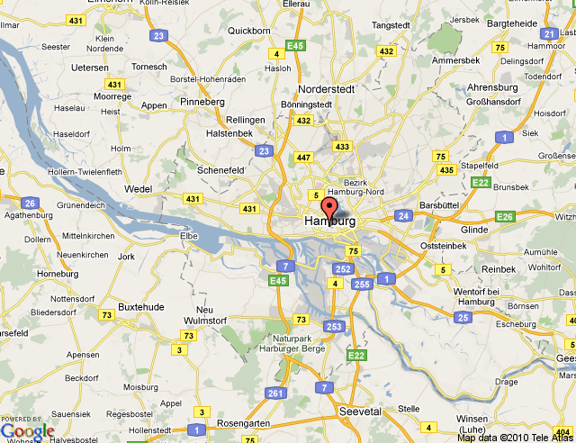

!SLIDE bullets

# Design #

!SLIDE bullets

# Layout #
 
!SLIDE bullets 

# Marker #

!SLIDE center 

!SLIDE center

!SLIDE center

!SLIDE center

# Colors #

!SLIDE bullets

# Test Map Types #

!SLIDE center

# Infowindow #

!SLIDE bullets

# Use your Style #

* Infowindow Background
* Styles Maps
* Static + Styled Maps

!SLIDE
  
# Styled Maps #

!SLIDE center

http://gmaps-samples-v3.googlecode.com/svn/trunk/styledmaps/wizard/index.html

    @@@javascript
    var styles = [
      {
        featureType: "all",
        elementType: "all",
        stylers: [
          { saturation: -100 }
        ]
      },{
        featureType: "water",
        elementType: "all",
        stylers: [
          { saturation: 58 },
          { hue: "#0091ff" },
          { lightness: -30 }
        ]
      }
    ];

    var my_style = new google.maps.StyledMapType(styles, {
      map: map,
      name: 'My Style'
    });

    map.mapTypes.set('My Style', my_style);
    map.setMapTypeId('My Style');

!SLIDE

# Cloude Made #

!SLIDE center

!SLIDE

    TILE_URL: new Template(
      "http://#{host}.tile.cloudmade.com/#{key}/#{style}/256/#{z}/#{x}/#{y}.png"
    ),
    
    _getTileUrl: function(tile, zoom){
      var host = ["a", "b", "c"][(tile.x + tile.y) % 3];

      return this.TILE_URL.evaluate({
        host: host,
        key: this.CLOUDMAP_KEY,
        style: this.styleID,
        x: tile.x,
        y: tile.y,
        z: zoom
      });
    }
    
!SLIDE bullets

# Static Maps #

* No JavaScript
* Single IMG tag
* Fast as hell

!SLIDE

    @@@html
    

!SLIDE

## Styled Static Maps ##

    @@@sh
    http://maps.google.com/maps/api/staticmap?
    sensor=false&size=512x512&center=Hamburg&zoom=12

!SLIDE center

!SLIDE

## Styled Static Maps ##

    @@@sh
    http://maps.google.com/maps/api/staticmap?
      sensor=false
      &size=512x512
      &center=Hamburg
      &zoom=12
      &style=
        feature:all|
        element:geometry|
        saturation:-100
      &style=
        ...

!SLIDE center

!SLIDE center

!SLIDE

## Custom Markers ##

    @@@sh
    http://maps.google.com/maps/api/staticmap?
      sensor=false
      &size=512x512
      &markers=
        icon:http://my_domain.com/marker.png|
        Hamburg

!SLIDE center

!SLIDE center

