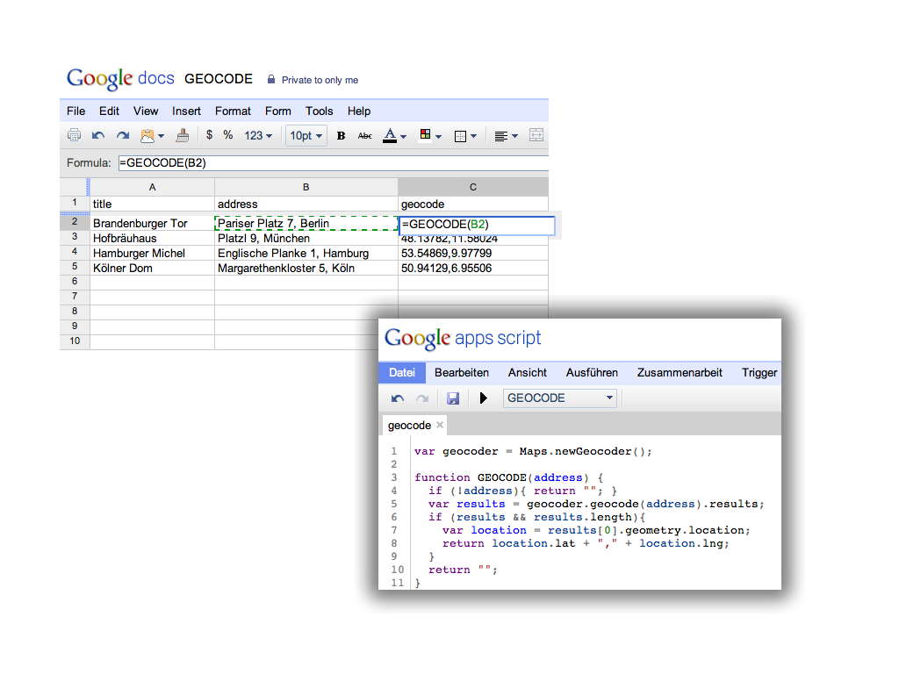
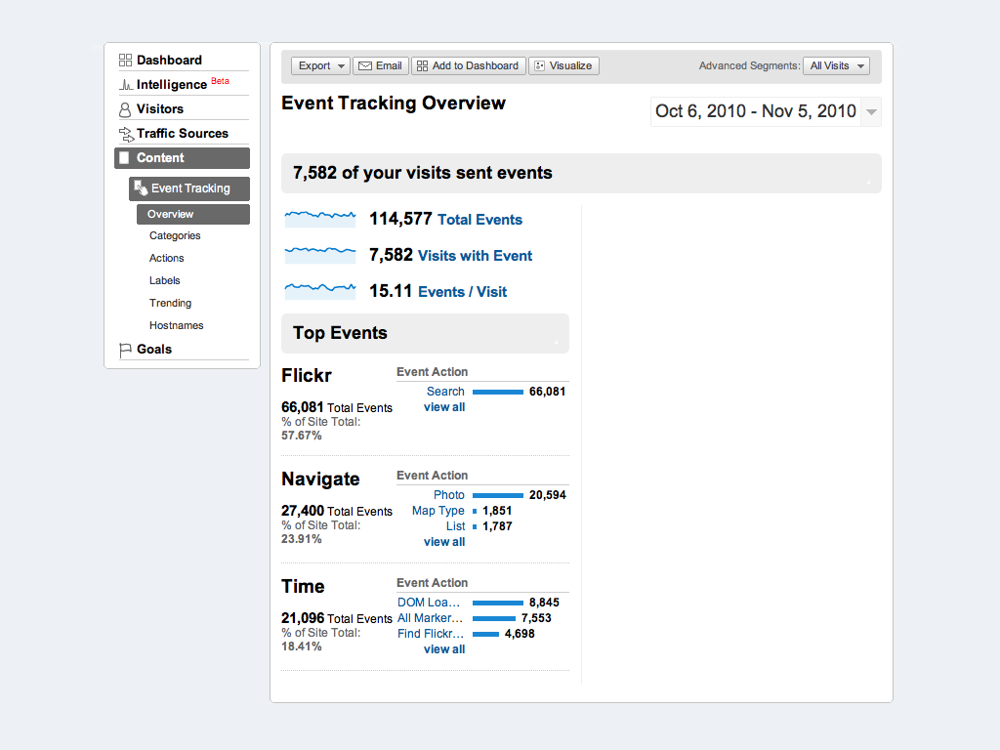
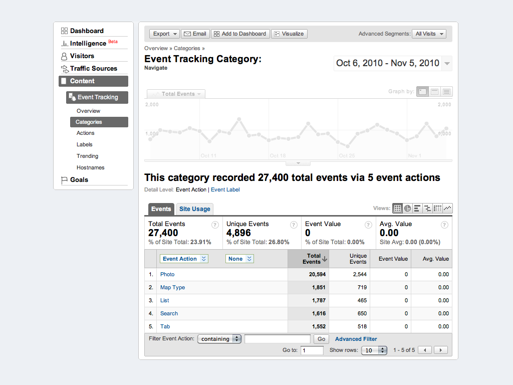

!SLIDE title-slide

# Tools #

!SLIDE bullets
## Google Spreadsheets ##

* No server setup
* Import and edit your data
* Create custom scripts and formulas
* Access via JSONP

    

!SLIDE

### Spreadsheet Formulas ###

    @@@sh
    =SUM(A2;B2)
    =CONCAT(A2;B2)
    =UPPER(B2)
    
    
    
    …

    
!SLIDE

### Spreadsheet Formulas ###

    @@@sh
    =SUM(A2;B2)
    =CONCAT(A2;B2)
    =UPPER(B2)

    =MY_FORMULA(B2)

    …

    
!SLIDE

### Spreadsheet Formulas ###

    @@@sh
    =SUM(A2;B2)
    =CONCAT(A2;B2)
    =UPPER(B2)

    =MY_FORMULA(B2)

    =GEOCODE(B2)

!SLIDE
### Geocode Formula ###

    @@@javascript
    var geocoder = Maps.newGeocoder();

    function GEOCODE(address) {
      if (!address){ return ""; }
      var results = geocoder.geocode(address).results;
      if (results && results.length){
        var location = results[0].geometry.location;
        return location.lat + "," + location.lng;
      } 
      return "";
    }

!SLIDE center

!SLIDE

### Map Spreadsheet Data ###

    @@@javascript
    $.getJSON("MY_PUPLIC_SHEET_URL", data_loaded);
    
    function data_loaded(data){
      $.each(data.feed.entry, function(){
        var geocode = this["gsx$geocode"]["$t"];
        var lat_lng = geocode.split(","),
        var position = new google.maps.LatLng(
          lat_lng[0], 
          lat_lng[0]
        );
      });
    }

!SLIDE bullets

## Google Analytics ##

* Problem: Single page view
* Solution: Track events
* Categories, actions, labels, values

!SLIDE
### Page Tracking ###

    @@@javascript
    // track current page
    pageTracker._trackPageview();
    
    // track a virutal page view
    pageTracker._trackPageview(
      "/path/to/virtual/page.html"
    );
    
    // example: virtual map view
    pageTracker._trackPageview(
      "/map/germany/berlin/reichstag"
    );

!SLIDE
### Event Tracking ###

    @@@javascript
    pageTracker._trackEvent(
      'category', 
      'action', 
      'label (optional)', 
      'value (optional)'
    );

!SLIDE
### Track Marker Events ###

    @@@javascript
    google.maps.event.addListener(
      marker, 
      'click',
      track_click
    });

    function track_click(){
      pageTracker._trackEvent([
        'Marker', 
        'Click', 
        marker_title
      );
    }

!SLIDE center

!SLIDE center

